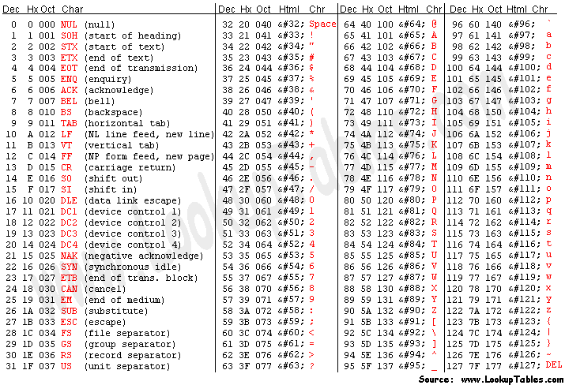

# [Regular Expression Fundamentals](https://app.pluralsight.com/course-player?courseId=54f3f5a1-91b5-4cab-861e-1ca5cdef8a64)
By Juliette Reinders Folmer

All contents under here are extracted purely from the linked PS course. No intention on copying just short notes to revisit incase I 👻

- [Regular Expression Fundamentals](#regular-expression-fundamentals)
  - [1.0 Fundamentals](#10-fundamentals)
    - [1.1 Building Initial Pattern](#11-building-initial-pattern)
    - [1.2 Simplify pattern by grouping](#12-simplify-pattern-by-grouping)
    - [1.3 Enabling case sensitive](#13-enabling-case-sensitive)
    - [1.4 Get word if only complete string matches](#14-get-word-if-only-complete-string-matches)
    - [1.5 Trim Whitespaces using Regex](#15-trim-whitespaces-using-regex)
    - [1.6 regexper.com](#16-regexpercom)
    - [1.7 regexcheatsheet.com](#17-regexcheatsheetcom)
  - [2.0 Character Class](#20-character-class)
    - [2.1 ASCII Character MAP](#21-ascii-character-map)
    - [2.2 WildCards](#22-wildcards)
    - [2.3 Quantifiers](#23-quantifiers)
    - [2.4 regex101.com](#24-regex101com)
    - [2.5 Alternation](#25-alternation)
    - [2.6 Sub Patern for grouping](#26-sub-patern-for-grouping)
    - [2.7 Anchors](#27-anchors)
    - [2.8 rubular.com](#28-rubularcom)
  - [3.0 Shortcodes, Modifiers, Delimeters](#30-shortcodes-modifiers-delimeters)
    - [3.1  Shortcodes](#31--shortcodes)
    - [3.2 Modifiers](#32-modifiers)
    - [3.3 Delimeter](#33-delimeter)

A regular expression is a sequence of characters that define a search pattern

---

## 1.0 Fundamentals

```
Pattern to validate 
    - # AB 12 34
```

1. `[]` - Square brackets contain the characters that may include within the word

2. `/` - Act as delimeters

3. `?` - Match zero or onetime

4. `*` - Match zero or moretime

5. `+` - Match one or more time


### 1.1 Building Initial Pattern

```
/#[ABCDEF0123456789]/
```

Characteristics    
- Starts with `#`
- `6` Characters

### 1.2 Simplify pattern by grouping

Only supports requential characters

```
/#?([A-F0-9]{6}|[A-F0-9]{3})/
```

1. `[A-F0-9]` - means a to f and 0 to 9

2. `{6}` - specifies no of characters

3. `?` - optional

4. `|` - or

5. `()` - for grouping

### 1.3 Enabling case sensitive

```
/#?([A-F0-9]{6}|[A-F0-9]{3})/
```
1. `[A-Fa-f0-9]` - add lowercase a-f
   -  /#?([A-F`a-f`0-9]{6}|[A-Fa-f0-9]{3})/

2. `i` - pattern modifier
   -  /#?([A-F0-9]{6}|[A-F0-9]{3})/`i`


### 1.4 Get word if only complete string matches

```
/#?([A-F0-9]{6}|[A-F0-9]{3})/
```

- Anchor the Regex

```regex
/^#?([A-F0-9]{6}|[A-F0-9]{3})$/i
```

1. `^` - denotes start of string

2. `$` - denotes end of string


### 1.5 Trim Whitespaces using Regex


```
/^\s*#?([A-F0-9]{6}|[A-F0-9]{3})\s*$/i
```

1. `\s*` - trims all sorts of whitespace

### 1.6 regexper.com

- To generate regex pattern visualization

### 1.7 regexcheatsheet.com

## 2.0 Character Class

1. Positive
   - `[a-zA-z]` - Extract string with chars a-z
2. Negative
   - `[^a-zA-z]` - Do not xtract string with chars a-z

### 2.1 ASCII Character MAP


### 2.2 WildCards

- `.` Match any character

### 2.3 Quantifiers

- `?` - Zero or Onetime  
- `*` - Zero or More Time
- `+` - One or More Time

### 2.4 regex101.com

Optimize your regex string, identify the steps taken by your regex & improve 

### 2.5 Alternation

Different regex engines comprmises of different search ways

- `|` - Pipe

### 2.6 Sub Patern for grouping

- `()` - grouping

### 2.7 Anchors

- `^$` - Bound to string or line

- `\n` - match at \n end somtimes

- `\b` - Word boundaries

### 2.8 rubular.com

## 3.0 Shortcodes, Modifiers, Delimeters

### 3.1  Shortcodes

- `[0-9]` - \d

- `[A-Za-z0-9_]` - \w

- `[\t\f\r\n]` - \s

Negated (like not in programming)

- `[^0-9]` - \D

- `[^A-Za-z0-9_]` - \W

- `[^\t\f\r\n]` - \S


### 3.2 Modifiers

- Left to right matching

- `g` - GLOBAL returns all

- `i` - Caseless (May not recognize some ASCII)

- `m` - multiline

- `s` - DOTALL or Singline line

### 3.3 Delimeter

Some languages use there own delemeters E.g. PHP

- Non Alphanumeric


- Non Backslash

- Non Whitespace